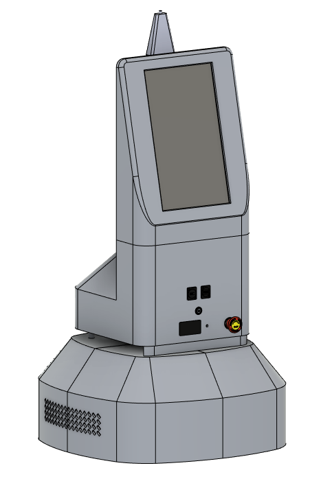

# SENARO V9D Robot Package


# Integrated Install dependencies
```
$ sudo apt-get update
$ sudo apt-get install build-essential git cmake libasio-dev
$ sudo apt install can-utils

$ sudo apt-get install libusb-dev
$ sudo apt-get install libudev-dev
```

# Set up tracer-mini CAN adapter
```
$ sudo modprobe gs_usb
$ sudo ip link set can0 up type can bitrate 500000
$ ifconfig -a
```

# Set up insta360
Insta360 SDK is not included in this repository. You have to apply for the sdk to get it.

🔗 SDK Apply Link: https://www.insta360.com/kr/sdk/apply